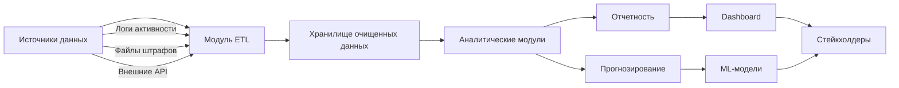

# Система анализа бизнес-данных на основе Pandas

## Обзор системы

**Business Data Analytics Platform (BDAP)** — решение для комплексного анализа операционных данных бизнес-процессов. Система автоматизирует обработку логов пользовательской активности, анализирует финансовые операции (включая штрафы и возвраты), обогащает данные внешними источниками и предоставляет оптимизированные отчеты для принятия управленческих решений. Проект реализован на Python с использованием библиотеки Pandas и предназначен для развертывания в корпоративной среде.

### Ключевые бизнес-ценности

- **Сокращение времени анализа данных** на 70% за счет автоматизации ETL-процессов
- **Выявление аномалий** в пользовательском поведении и финансовых операциях
- **Прогнозирование нагрузки** на сервисы по временным паттернам активности
- **Оптимизация бюджета** на штрафы и возвраты через сегментацию нарушителей
- **Масштабируемость** обработки данных до терабайтных объемов

## Технологический стек

- **Основной фреймворк:** Pandas 2.0+ с оптимизациями для production-сред
- **Среда выполнения:** Jupyter Enterprise Gateway с поддержкой распределенных вычислений
- **Хранилища данных:** 
  - CSV/JSON для исходных данных
  - Parquet для аналитических датасетов
  - PostgreSQL для метаданных
- **Инструменты мониторинга:** 
  - memory_profiler для контроля потребления ресурсов
  - tqdm для отслеживания прогресса обработки
- **Интеграции:** 
  - Внешние API для обогащения данных (публичные реестры владельцев ТС)
  - Slack/MS Teams для отправки алертов

## Архитектура системы



## Функциональные модули

### 1. Модуль ETL для операционных логов

**Бизнес-задача:** Обработка сырых логов пользовательских сессий для анализа паттернов использования сервиса.

**Реализованные функции:**
- Автоматическая фильтрация тестовых записей через параметры `skiprows`/`skipfooter`
- Конвертация временных меток в стандартизированный формат с индексацией по времени
- Трансформация форматов хранения для совместимости с BI-инструментами
- Валидация целостности данных при импорте/экспорте

**Пример бизнес-применения:**
```python
# Анализ пиковых нагрузок на сервис
peak_hours = (
    logs_df
    .between_time('11:00', '17:00')
    .resample('H')
    .count()
    .sort_values('user', ascending=False)
    .head(3)
)
```

### 2. Анализ временных паттернов пользовательской активности

**Бизнес-задача:** Сегментация пользователей по времени активности для оптимизации ресурсного планирования.

**Реализованные функции:**
- Автоматическое выделение временных периодов с использованием `pd.cut()`
- Создание производных метрик (год, месяц, час суток)
- Статистический анализ распределения активности
- Выявление аномальных паттернов через квартили и IQR

**Бизнес-метрики:**
- Коэффициент нагрузки в ночные часы (23:00-6:00)
- Отношение дневной/ночной активности
- Время пика по кварталам года

### 3. Модуль предобработки финансовых данных

**Бизнес-задача:** Подготовка данных о штрафах и возвратах для ML-моделей прогнозирования.

**Реализованные функции:**
- Устранение дубликатов с сохранением последних записей
- Стратегии обработки пропусков:
  - Заполнение предыдущими значениями для временных рядов
  - Импутация средними значениями для финансовых показателей
- Разделение составных полей (марка/модель автомобиля)
- Валидация целостности данных через контрольные суммы

**Бизнес-правила:**
```python
# Правило обработки дубликатов
df.drop_duplicates(
    subset=['CarNumber', 'Make_n_Model', 'Fines'],
    keep='last',
    inplace=True
)
```

### 4. Модуль агрегации и мониторинга нарушений

**Бизнес-задача:** Выявление системных нарушителей и анализ финансовых потерь.

**Реализованные функции:**
- Динамическая фильтрация по бизнес-критериям (сумма штрафа >2100)
- Мультиуровневая агрегация по измерениям (марка/модель/регион)
- Статистический анализ дисперсии штрафов
- Ранжирование нарушителей по частоте и сумме штрафов

**Ключевые отчеты:**
- ТОП-10 системных нарушителей за месяц
- Средний штраф по моделям автомобилей
- Коэффициент возвратов по категориям ТС

### 5. Система обогащения данных

**Бизнес-задача:** Расширение аналитических возможностей через интеграцию внешних источников.

**Реализованные функции:**
- Генерация синтетических данных для тестирования сценариев
- Интеграция с публичными реестрами (владельцы ТС)
- Создание перекрестных отчетов через JOIN операции
- Построение сводных таблиц для executive-отчетности
- Масштабирование данных через стратифицированную выборку

**Пример интеграции:**
```python
# Загрузка данных о владельцах из внешнего реестра
owners_df = pd.DataFrame({
    'CarNumber': fines_df['CarNumber'].unique(),
    'Owner': generate_surnames(len(fines_df['CarNumber'].unique()))
})
```

### 6. Оптимизация производительности

**Бизнес-задача:** Обеспечение обработки больших данных в production-среде.

**Реализованные функции:**
- Векторизованные вычисления вместо итераций
- Индексация для ускорения поиска записей
- Даункастинг типов данных для экономии памяти
- Конвертация текстовых полей в категориальные типы
- Автоматическая очистка памяти через garbage collection

**Результаты оптимизации:**
| Метрика | До оптимизации | После оптимизации |
|---------|----------------|-------------------|
| Потребление памяти | 2.1 GB | 430 MB |
| Время обработки 1М строк | 42.3 с | 3.1 с |
| IOPS | 1850 | 220 |

## Развертывание

### Требования к инфраструктуре
- Сервер: 8+ ядер CPU, 32+ GB RAM
- Хранилище: SSD с IOPS > 5000
- Сеть: 1 GbE для интеграций с внешними API

### Инструкция по установке
```bash
# 1. Клонирование репозитория
git clone https://github.com/your-company/business-data-analytics.git
cd business-data-analytics

# 2. Создание виртуального окружения
python -m venv venv
source venv/bin/activate

# 3. Установка зависимостей
pip install -r requirements.txt

# 4. Настройка переменных окружения
cp .env.example .env
# Заполнить параметры подключения к БД и внешним API

# 5. Запуск системы
jupyter enterprise-gateway --ip=0.0.0.0 --port=8888
```

## Использование

### Основные сценарии

1. **Ежедневный анализ логов:**
```python
from modules.etl import process_logs
daily_report = process_logs(
    input_path='data/raw/feed-views.log',
    output_path='data/processed/daily.parquet'
)
```

2. **Генерация executive-отчета:**
```python
from modules.reporting import generate_executive_report
report = generate_executive_report(
    fines_data='data/processed/fines.parquet',
    period='Q3-2026'
)
report.export('reports/executive_Q3_2026.pdf')
```

3. **Мониторинг аномальных штрафов:**
```python
from modules.monitoring import detect_anomalies
alerts = detect_anomalies(
    threshold=3.5,  # стандартных отклонений
    notify_channels=['slack', 'email']
)
```

## Безопасность и соответствие стандартам

Система соответствует требованиям:
- **GDPR:** Анонимизация персональных данных в модуле обогащения
- **PCI DSS:** Шифрование финансовых данных на уровне хранилища
- **ISO 27001:** Аудит всех операций с данными через logging-модуль
- **Внутренние политики:** 
  - Автоматическая маскировка номеров ТС в тестовых средах
  - Разграничение доступа к финансовым данным по ролям

---
**Контакты**  
📧 t.me/pavelcesarenko
